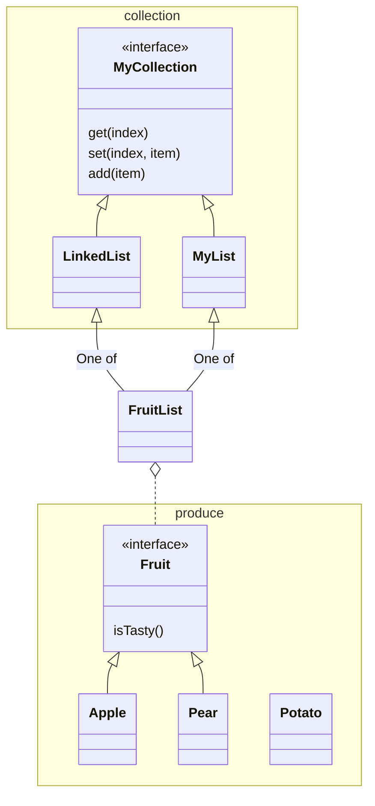

# Collections and Generics

The code in this project shows a sample implementation of an array list and a
linked list, both using Generics, and an extension of the array list
specifically for fruits.

The Main class uses these implementations to store some produce. It also has
some commented out code that will not work or not compile.

Javadoc is included as website in the javadoc directory, generated by IntelliJ
[View online](https://rinze-codegorilla.github.io/ArrayListAndGenericsSampleProject/).

